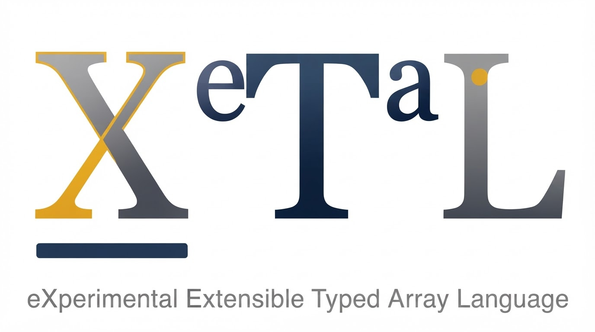

<p align="center">
  
</p>

# X_eTaL extensions

<p align="center">
  <b><a href="https://softwarewrighter.github.io/X_eTaL-extensions/">The demos, recorded</a></b>
  -- X_eTaL programs calling native Rust extensions, and how to run them yourself
</p>

<p align="center">
  
</p>

Native extensions for [X_eTaL](https://github.com/softwarewrighter/X_eTaL),
the eXperimental Extensible Typed Array Language: small Rust libraries
that give X_eTaL programs what the interpreter cannot do by itself --
a clock, hashing, regular expressions, fast linear algebra, image
files -- each used from X_eTaL like any other library.

## Start here

```sh
git clone https://github.com/softwarewrighter/X_eTaL-extensions
cd X_eTaL-extensions
just xetal                      # X_eTaL at its known-good commit (cloned into work/xetal)
cargo build --workspace
just demos                      # every demo: EXT NAME and what it shows
just demo hello tour            # X_eTaL arrays handed to Rust and back
just demo sqlite notebook       # CO2 at Mauna Loa: SQLite + X_eTaL, pictures in work/draw/
just demo canvas life           # Life in a native window (Space: new board, q: quit)
just demo audio spectrum        # the music visualizer: X_eTaL analyzes, Rust plays and draws
just demo audio synth           # a synthesizer: every sample computed in X_eTaL, played as made
just demo audio scope           # a live oscilloscope: the synthesizer drawn as it plays
just demo web life              # a web page whose Life board X_eTaL steps per request (http://127.0.0.1:8470/)
just demo web todomvc           # TodoMVC: X_eTaL serves it, SQLite keeps it (http://127.0.0.1:8470/)
just demo http quakes           # a week of earthquakes: SQL groups, X_eTaL computes, pictures in work/draw/
just live-quakes                # the same on the live USGS feed (uses the network)
just demo image photo-lab       # a photo as an array: filters, edges, SVD compression (work/photo-lab/)
just demo scene voxels-world    # a voxel island of 32 chunks: X_eTaL builds it and finds its faces, Rust draws them
just demo scene voxels-walk     # walk on it in the first person (W A S D, Space, drag to look)
just demo scene voxels-endless  # walk an endless world under a curved horizon
just demo scene voxels-fly      # fly over it (F: fly or walk; Space up, Shift down)
just demo scene voxels-rubik    # a Rubik's cube of voxels: u d r l f b turn, z undo, Space scramble
just demo scene voxels-rubik-turn  # one layer of the cube turning a quarter revolution, on three axes
just demo scene voxels-dig      # dig (click) and build (right-click) in the endless world; 1-7 choose the block
just demo scene voxels-water    # dig the rim of a lake on a hill and watch it run down the steps
just demo scene voxels-rubik-buttons  # the cube with buttons: U U' R R' F F', animated, queued, undo
just walkthrough                # a fresh clone, built and run, checked against the goldens
```

([`just`](https://github.com/casey/just) runs the recipes.) What works
today, extension by extension: [docs/status.md](docs/status.md). Every
facade, shared library and demo, cross-referenced with its types and
its documentation:
[the docs](https://softwarewrighter.github.io/X_eTaL-extensions/doc/)
(`just doc`; built by X_eTaL's `xetal doc`).

## What this is

**Libraries extend the vocabulary; macros extend the language; native
extensions extend the machine.** X_eTaL is extensible three ways:
ordinary `.xtl` libraries add typed array code, `.xtlm` macro
libraries add notation that expands into ordinary X_eTaL (both in
[X_eTaL-libraries](https://github.com/softwarewrighter/X_eTaL-libraries)),
and native extensions -- this repository -- add capabilities the
language should not reinvent: a database engine, a clock, image
codecs, fast numerical code. Each is a Rust library behind an
ordinary, statically typed X_eTaL facade, so a program imports it like
any other library and the type checker sees its functions' types; the
language core stays small. Here the three meet: every facade is
written with a macro, the binding macro `lib/Ffi.xtlm`.

For example, the data notebook loads a CSV into SQLite, lets SQL do
what it is good at (selecting, grouping) and X_eTaL what it is good at
(whole-array arithmetic: the yearly rise of CO2 at Mauna Loa, a
least-squares line, its residuals, a histogram), and draws the result:

```
"sq:" u_se< "Sqlite"
db sq:i_mport "co2=demos/data/co2-mlo-annual.csv"
m := db sq:n_ums "select year, mean from co2 order by year"
c := 2 s_elect_2 m
d := (1 d_rop c) - -1 d_rop c            # the rise each year, as one array
```

A smaller example:

```
"hx:" u_se< "Hello"
hx:s_hout "x_etal"                          # X_ETAL, upper-cased in Rust
hx:s_um (r_ange 10) '* t_able r_ange 10      # 3025.0, a 10 by 10 array summed in Rust
```

The program does not know whether `hx:s_um` is X_eTaL, Rust or C.
Behind the facade:

- each extension is a Rust shared library (`.dylib` / `.so`) that
  exports one C-ABI descriptor (ABI V1): its name, version and a
  table of typed functions;
- a loader validates the descriptor, copies it, and calls the
  functions, containing errors and panics;
- a facade library (`Sqlite.xtl`) gives each function an X_eTaL name
  and type, one line each: `"e_xec : text text -> int" ffi:b_ind<
  "sqlite/exec"`, a macro call that writes the function
  ([docs/ffi-macro.md](docs/ffi-macro.md)).

X_eTaL does not yet have a native hook, so for now programs that use
extensions run with the bridge host `xetal-x` instead of `xetal` (see
`docs/xetal-asks.md`, E1). `xetal-x` is X_eTaL's `xetal` -- every
subcommand and message the same -- plus extensions:

```sh
just ext-list                 # the extensions here and their functions
just run-x prog.xtl           # xetal-x --ext extensions run prog.xtl
```

How the channel works, and what its errors look like:
[docs/bridge.md](docs/bridge.md). When X_eTaL gains the hook, the facades
change and the programs do not.

## Extensions

**Status: experimental.** Release 1 is **hello, clock and sqlite**,
with the data notebook as its flagship demo. The native extension ABI
and the `ext:` bridge (`xetal-x`) are previews: X_eTaL will call native
code itself one day (docs/xetal-asks.md, E1), and programs will not
change when it does. Canvas (a native window) is the first piece of
the media work -- audio and 3D, like the MP3 visualizer -- which
follows the ecosystem's launch, as do the other roadmap extensions.

| Demo | Extensions | What it shows | Status |
| ---- | ---------- | ------------- | ------ |
| [data notebook](extensions/sqlite/docs/README.md#the-data-notebook) | sqlite | CO2 at Mauna Loa: a CSV in SQLite; SQL groups, X_eTaL computes the yearly rise, a least-squares line and its residuals, a histogram; SVG pictures | release 1, done |
| [X_eTaL on the web](extensions/web/docs/README.md#demos) | web, sqlite | a live page: Life computed in X_eTaL, one generation per request, drawn as SVG (`just demo web life`); a TodoMVC kept in SQLite (`just demo web todomvc`) | done |
| [photo lab](extensions/image/docs/README.md#demos) | image, linalg | a photo as an array: blur, sharpen and edges by rotation, sepia by an inner product, SVD compression at ranks 5, 20, 50; PNGs out (`just demo image photo-lab`) | done |
| [fetch and analyze](extensions/http/docs/README.md#demos) | http, digest, sqlite | a week of earthquakes: the USGS feed checked by SHA-256, into SQLite, the Gutenberg-Richter b-value computed in X_eTaL, a world map (`just demo http quakes`; the live feed: `just live-quakes`) | done |

| Extension | Facade | What | Crates | Status |
| --------- | ------ | ---- | ------ | ------ |
| [hello](extensions/hello/docs/README.md) | `Hello` | the smallest proof of the boundary | -- | done: facade, tests, demo |
| [clock](extensions/clock/docs/README.md) | `Clock` | wall-clock and monotonic time; the bridge's cost | std | done: facade, tests, cost demo |
| [audio](extensions/audio/docs/README.md) | `Audio` | decode Ogg Vorbis, MP3, WAV; play; read what plays as arrays; play arrays | symphonia, cpal | done: the music visualizer, the synthesizer, the oscilloscope |
| [canvas](extensions/canvas/docs/README.md) | `Canvas` | a native window showing arrays as pixels; keys and clicks back | winit, softbuffer | done: Life demo (media work continues after the launch) |
| [scene](extensions/scene/docs/README.md) | `Scene` | retained 3D lines, points and shaded quads in a native window, patched by id; orbit camera, depth buffer, fog | winit, softbuffer | done: the cube; voxels 1 to 10 (a chunk as an array, its faces, drawn solid, a world of chunks, walking, an endless world, flying, a Rubik's cube and its quarter turns, digging and building, water that flows, a Rubik's cube with buttons) |
| [sqlite](extensions/sqlite/docs/README.md) | `Sqlite` | execute and query SQLite files; CSV import | rusqlite | done: facade, CSV import, tests, the data notebook |
| [web](extensions/web/docs/README.md) | `Web` | serve HTTP on loopback: the program takes each request and replies | axum, tokio | done: facade, loopback tests, the live page, TodoMVC |
| [image](extensions/image/docs/README.md) | `Image` | PNG and JPEG to and from Float arrays; resize | image | done: facade, round-trip tests, the photo lab |
| [linalg](extensions/linalg/docs/README.md) | `Linalg` | solve, inverse, determinant, least squares, eigenvalues, SVD | nalgebra | done: facade, cross-checked in pure X_eTaL |
| [http](extensions/http/docs/README.md) | `Http` | bounded GET (size, time, redirects); downloads | ureq | done: facade, loopback tests, the earthquake report |
| [digest](extensions/digest/docs/README.md) | `Digest` | SHA-256 and CRC-32 of text and files | sha2, crc32fast | done: facade, vectors, tests |

Each extension is a self-contained directory, `extensions/NAME/`: its
manifest (`extension.toml`), its own `justfile`, its Rust crate
(`rust/`), its X_eTaL sources (`lib/`), its reg-rs tests (`tests/`),
its docs (`docs/`) and its demos (`demos/`). `just new-ext NAME ALIAS
"what"` starts one from `templates/extension/`; `just ext NAME RECIPE`
runs one of its recipes from the repository root.

## Writing an extension

An extension is plain Rust: functions taking the X_eTaL arguments and
returning a value or an error, listed once with their arity, X_eTaL
type and a line of documentation. The SDK generates the C boundary.

```rust
use xetal_ext_sdk::{OwnedError, Value, text};

fn shout(args: &[Value]) -> Result<Value, OwnedError> {
    Ok(Value::Text(text(&args[0])?.to_uppercase()))
}

xetal_ext_sdk::xetal_extension! {
    name: "hello",
    version: env!("CARGO_PKG_VERSION"),
    functions: {
        shout: 1, "Char -> Char", "The text in upper case.";
    }
}
```

See [`extensions/hello`](extensions/hello/rust/src/lib.rs) and the
[ABI](docs/abi-v1.md).

## Loading an extension from Rust

A host loads extensions with `xetal-ext-loader`: a package directory
(its `extension.toml`) names the library; the registry finds it
(`native/<platform>/` in the package, then any build directories
given), validates its descriptor against ABI V1 and the manifest, and
calls its functions by name with owned values:

```rust
use xetal_ext_loader::{Package, Registry, Value};

let mut registry = Registry::new();
let package = Package::open("extensions/hello")?;
registry.load_package(&package, &["target/debug".into()])?;
let shout = registry.call("hello", "shout", &[Value::Text("hi".into())])?;
```

Errors, wrong argument counts and panics inside an extension come back
as `CallError`s; the library stays loaded as long as the registry
holds it.

## Build

Requires Rust, [`just`](https://github.com/casey/just) and git. X_eTaL
is not copied into this repository: `XETAL_COMMIT` names the
known-good commit, and `just xetal` clones X_eTaL into `work/xetal/`
(ignored by git), checks that commit out, builds it and links
`bin/xetal` (the first time takes a few minutes and the network;
`XETAL_SOURCE=../X_eTaL just xetal` clones a local checkout instead).

```sh
just            # list the recipes
just gate       # everything the pre-commit gate checks
just build           # every crate and extension (shared libraries in target/debug/)
just test [CRATE]    # the Rust tests
just test-exts       # every extension's reg-rs tests (reg-rs on PATH; release build, extensions side by side)
just videos [EXT [NAME]]  # record the demos, or one (vhs; window demos from headless frames; web pages by headless Chrome): nothing on screen
just pages           # build the site into pages/ (the recordings and how to run them); commit it, a push publishes it
just check-pages     # pages/ is up to date (the gate fails if not)
just check-docs      # every export documented (## above it), every ## >> example run
just doc             # the cross-referenced docs alone (pages/doc)
just serve-pages     # preview it at http://127.0.0.1:8470/X_eTaL-extensions/ (this repo's port: 8470)
just xetal           # X_eTaL at XETAL_COMMIT: work/xetal, bin/xetal
just xetal-version   # the known-good X_eTaL commit
just eval "'+ r_/ 1 2 3"   # evaluate with the known-good xetal
```

Moving to a newer X_eTaL: put its full commit in `XETAL_COMMIT`, run
`just xetal` and `just gate`, commit.

## Development

Development is tracked with agentrail sagas, as in X_eTaL: `agentrail
status` shows the current step, `agentrail next` its instructions.
The plan is `docs/plan.md`; what the extensions need from X_eTaL is
`docs/xetal-asks.md`. Every step ends with the gate passing, docs
updated, a commit to `main` and a push.

## Related Projects

- [X_eTaL](https://github.com/softwarewrighter/X_eTaL) -- the language
  ([try it live](https://softwarewrighter.github.io/X_eTaL/))
- [X_eTaL-libraries](https://github.com/softwarewrighter/X_eTaL-libraries)
  -- libraries written in X_eTaL
- [X_eTaL-demos](https://github.com/softwarewrighter/X_eTaL-demos) --
  visual demos ([live](https://softwarewrighter.github.io/X_eTaL-demos/))
- [sw-mlpl](https://github.com/sw-ml-study/sw-mlpl) -- Software
  Wrighter's Machine Learning Programming Language, a Rust array
  language inspired by APL, APL2, J, and BQN, whose native extension
  design this repository adapts.

## Links

- Blog: [Software Wrighter Lab](https://software-wrighter-lab.github.io/)
- Discord: [Join the community](https://discord.com/invite/Ctzk5uHggZ)
- YouTube: [Software Wrighter](https://www.youtube.com/@SoftwareWrighter)

## Copyright

Copyright (c) 2026 Michael A Wright

## License

MIT. See [`LICENSE`](LICENSE) and [`COPYRIGHT`](COPYRIGHT).
