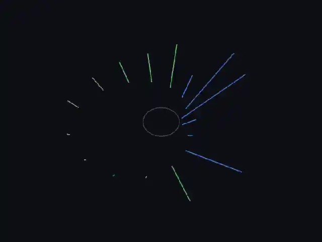
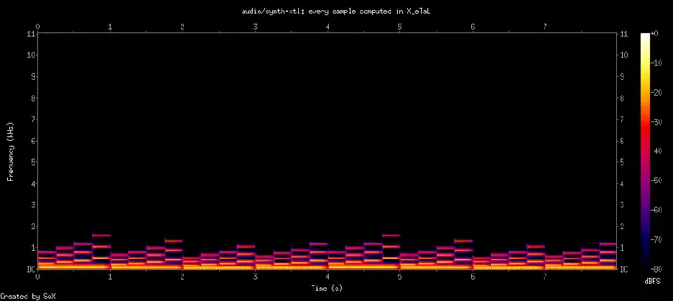
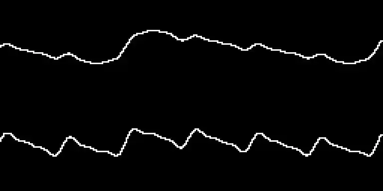

# audio

Audio files for X_eTaL: decode Ogg Vorbis, MP3 and WAV, play them on the
sound device, and read what is playing as arrays -- the window of
samples under the playhead, for analysis and pictures (the visualizer).

- Package: `extensions/audio/` (a shared library, loaded like hello)
- Facade: `lib/Audio.xtl`, recommended alias `au:`
- Native crates: `symphonia` 0.5 (pure Rust decoding: Ogg Vorbis, MP3,
  WAV; MPL-2.0) and `cpal` 0.15 (the sound device: CoreAudio, ALSA).
  Decoding and the playback queue are adapted from
  sw-ml-study/demo-extensions' audio (same author, MIT).
- Formats: Ogg Vorbis first (royalty-free by design); MP3's patents
  have expired, so it is supported too (plan M6).

## From X_eTaL

```
"au:" u_se< "Audio"
a := au:o_pen "demos/data/arpeggio.ogg"
au:i_nfo a                       # 44100.0 2.0 ... rate, channels, frames, seconds
p := au:p_lay! a                 # sound starts; it keeps playing on its own
w := a au:w_indow 1024           # 2 by 1024: what plays now, left over right
```

| Export | Type | What |
| ------ | ---- | ---- |
| `au:o_pen path` | `Char -> Int` | an audio file; its id |
| `au:i_nfo id` | `Num a => a -> Float` | sample rate, channels, frames, seconds (-1 when the file does not say) |
| `id au:c_hunk n` | `(Num a, Num b) => a -> b -> Float` | the next `n` frames read in order, apart from playback: 2 by m, fewer at the end |
| `au:p_lay! id` | `Num a => a -> Int` | start or resume playing |
| `au:p_ause! id` | `Num a => a -> Int` | pause |
| `id au:s_eek! t` | `(Num a, Num b) => a -> b -> Float` | move playback to `t` seconds; where it landed |
| `au:p_osition id` | `Num a => a -> Float` | the second playing now |
| `id au:w_indow n` | `(Num a, Num b) => a -> b -> Float` | the `n` frames ending at what plays now, 2 by n (zeros before the start) |
| `au:s_tate id` | `Num a => a -> Int` | 0 stopped (not started, or at the end), 1 playing, 2 paused |
| `au:c_lose! id` | `Num a => a -> Int` | stop and forget a file; a voice first plays out what is queued (or writes its WAV) |
| `au:o_utput rate` | `Num a => a -> Int` | a voice playing what the program queues, at `rate` frames a second; its id |
| `id au:q_ueue! s` | `(Num a, Num b) => a -> b -> Float` | play these samples after what is queued: a vector (mono) or 2 by n (left over right), -1 to 1; the seconds queued ahead |
| `id au:w_ait! t` | `(Num a, Num b) => a -> b -> Float` | wait until at most `t` seconds are queued (streaming without hurrying); the seconds played |
| `au:p_layed id` | `Num a => a -> Float` | the second a voice is playing now, to draw what is heard (with no device a virtual clock: a 60th of a second more each time it is asked) |

## The visualizer

<p align="center">
  
</p>

`demos/spectrum.xtl` (`just demo audio spectrum`): the arpeggio plays
while 16 spokes in a 3D window follow it -- the music player visualizer
of sw-MLPL's demo-extensions, for X_eTaL. Space pauses, j and k go back
or on 5 seconds, q quits; drag to turn the scene. Rust decodes, plays
and draws; X_eTaL does the rest:

| Step | X_eTaL |
| ---- | ------ |
| what is playing | `a au:w_indow 1024`: 2 by 1024 samples under the playhead |
| a taper | times a Hann window (`0.5 - 0.5 * c_os ...`), one row per channel |
| a spectrum | one inner product each with cosine and sine tables (1024 by 8: 60 Hz to 7680 Hz, an octave apart), the magnitude, squashed to 0..1.3 |
| motion | each frame eases 40% toward the new loudness |
| the geometry | 16 spokes on a circle, left channel's half mirrored by the right's; bass nearest the centre; loudness lengthens a spoke outward and lifts its tip; laid out as rows by an index trick (no transpose yet) |
| the picture | three `sc:s_egments!` objects, one per band: bass blue, mid green, high orange |

The recording `videos/spectrum.webm` has the music in it (unmute it);
it was made with no window and no sound device: each headless frame is
a 60th of a second of the music, saved, joined, and the music added
back (`videos/spectrum.frames`). To use your own file, change the path
in the demo (Ogg Vorbis, MP3 or WAV; `local-media/` is ignored by git).

A release build draws a frame in about 14 ms (the analysis is about
33,000 multiply-adds in X_eTaL plus the bridge); `just demo` uses one.

## The synthesizer

<p align="center">
  
</p>

`demos/synth.xtl` (`just demo audio synth`): the visualizer reversed --
X_eTaL computes every sample of eight bars of music and the extension
plays them as they are made:

| Step | X_eTaL |
| ---- | ------ |
| pitch | equal temperament: `440.0 * 2.0 ^ (f_loat k) / 12.0` for k semitones from A4 |
| a tone | three harmonics (1, 1/2, 1/4) for a whole chord at once: a table of sines, one row per note (`f '* t_able t`) |
| an envelope | attack, decay toward 60% (`e_xp`), release -- one vector, multiplied into every row |
| an arpeggio | the chord's rows laid end to end (`r_avel`) |
| the bass | the chord's root two octaves down, the length of the bar |
| stereo | 2 by n: the arpeggio more to the right, the bass more to the left |
| streaming | `v au:q_ueue! bar`, then `v au:w_ait! 0.5`: the next bar is made while this one sounds |

The recording `videos/synth.webm` is the piece's spectrogram with its
sound, made with no sound device: `XETAL_AUDIO=off
XETAL_AUDIO_WAV=FILE` collects everything queued in a WAV
(`videos/synth.sound`); the reg-rs test `audio-demo-synth` pins that WAV.

## The oscilloscope

<p align="center">
  
</p>

`demos/scope.xtl` (`just demo audio scope`): the synthesizer's music
plays while a window draws the waveform under the playhead, left
channel above and right below, triggered like a real scope. Untriggered
(the first version, which the user saw sliding), about 1,400 pixels of
the trace changed from one frame to the next; triggered, 40 to 250 --
what is left is the notes' envelopes decaying, and a jump when a note
changes. The instruments are an ordinary X_eTaL
library beside the demos, `demos/Instruments.xtl` (`"in:" u_se<
"Instruments"`), shared with `synth.xtl` -- one program using an
ordinary library and two native extensions (audio, canvas).

| Step | X_eTaL |
| ---- | ------ |
| the piece | eight bars made first and joined side by side (`c_at_2`): 2 by 176,384 |
| streaming | a bar is queued (`au:q_ueue!`) whenever less than 0.6 s is ahead of the playhead (`au:p_layed`) |
| the trigger | as a real scope's: from the playhead, the first rising zero crossing of the left channel (the bass) within 2048 samples -- `((-1 d_rop s) < 0.0) * (1 d_rop s) >= 0.0`, then `i_ndexOf 1` -- so a steady chord stands still instead of sliding; both channels drawn from it |
| what is heard | the 512 samples from the trigger, every other one (an index vector into the piece) |
| the trace | each sample's row on a 64-row picture, each column lit from its row to the next sample's (`'>= t_able` times `'<= t_able`), so steep edges stay joined; left and right stacked |
| the window | `cv:s_how!` each frame; q or closing quits; the end of the music ends it |

Its recording `videos/scope.webm` has the sound the demo made itself
(`wav=1` in `videos/scope.frames`: its voice collected in a WAV with no
device); the reg-rs test `audio-demo-scope-headless` pins two frames
and that sound.

## How playback runs

Playing does not depend on the program's pace. A thread of the
extension owns the decoder and the device: it decodes about a quarter
second ahead into the device's queue (resampled when the device runs at
another rate), and counts the frames the device has actually played.
`au:w_indow` reads the last seconds decoded at that count, so a picture
drawn from it matches what is heard, however fast the program draws.

Without a device -- `XETAL_HEADLESS=1` or `XETAL_AUDIO=off` -- nothing
sounds, and each `au:w_indow` advances playback by a 60th of a second:
a program's frames then see exactly the same audio on every run, which
the tests rely on.

## Test media

Generated by `tests/make-media.sh` (sox, lame) and committed, all ours:
`tests/data/tone.ogg`, `.mp3` (2 s) and `.wav` (0.5 s): 440 Hz on the
left, 880 Hz on the right, at 22,050 Hz; `demos/data/arpeggio.ogg`:
16 s of a plucked I-vi-IV-V arpeggio over a bass, 44,100 Hz. Your own
music can go in `local-media/` (ignored by git).

## Build and test

```sh
just build      # the shared library and xetal-x
just test       # Rust tests and reg-rs tests, with no sound device
```

The Rust tests decode each format and tell the channels apart by their
zero crossings, read to the end and seek, and step the virtual player.
The reg-rs tests run the facade with no device -- including a
four-frequency spectrum by one inner product that finds 440 Hz on the
left and 880 Hz on the right -- and check the formats and a missing
file. Playing through the speakers is checked by ear: the visualizer and the
oscilloscope ran live on the user's machine on 2026-10-04 ("sounds
great"); the oscilloscope ends by itself with the music.
A Rust test writes a voice to a WAV and reads it back.
