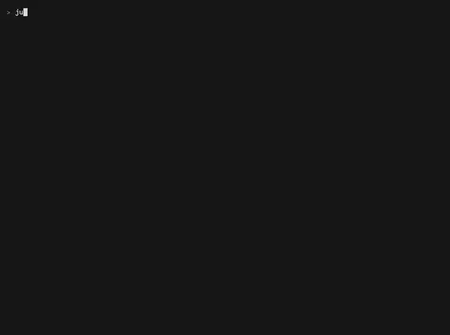

# http

<p align="center">
  
</p>

Bounded HTTP GET for X_eTaL: text from the web -- a CSV feed, a JSON
document -- within limits on size, time and redirects, through ureq
(HTTP/1.1, rustls). The network is used only when a program asks; this
repository's tests fetch from servers on loopback.

- Package: `extensions/http/` (`extension.toml`; library
  `xetal_ext_http`: `libxetal_ext_http.dylib` on macOS, `.so` on Linux)
- Facade: `lib/Http.xtl`, recommended alias `ht:`
- Native crates: `ureq` 3 (rustls: no system TLS library); for tests,
  the web extension's server and `tempfile`

## From X_eTaL

```
"ht:" u_se< "Http"
url := "https://earthquake.usgs.gov/earthquakes/feed/v1.0/summary/2.5_week.csv"
csv := ht:g_et url                        # the feed, as text
ht:s_tatus @                              # 200
ht:h_eader "content-type"                 # text/csv
url ht:s_ave! "work/quakes.csv"           # into a file: its bytes
```

| Export | Type | What |
| ------ | ---- | ---- |
| `ht:g_et url` | `Char -> Char` | GET the URL: its body as text (bytes that are not UTF-8 are replaced); a status other than 2xx is an error naming it |
| `ht:s_tatus @` | `Unit -> Int` | the last response's status; 0 if none came |
| `ht:h_eader name` | `Char -> Char` | a header of the last response (any case); `""` when absent |
| `url ht:s_ave! path` | `Char -> Char -> Int` | the body into a file under the working directory (or `XETAL_HTTP_ROOT`; relative, no `..`), written whole or not at all; how many bytes |

Native functions: `get`, `status`, `header`, `save` (`just list`).

## Limits

- **Size:** a body over `XETAL_HTTP_MAX` bytes (16 MiB by default) is
  an error, read no further.
- **Time:** a fetch that takes longer than `XETAL_HTTP_TIMEOUT`
  seconds (30 by default), connecting and reading included, is an
  error.
- **Redirects:** up to 5 are followed.
- **Schemes:** only `http://` and `https://`; `file:` and the rest are
  refused.

Errors are X_eTaL errors with the extension's message:

```
error[io]: []N_GET: ext:http/get: GET http://127.0.0.1:8470/missing.csv: 404 Not Found at ./lib/Http.xtl:12:1
```

## Build and test

```sh
just build      # the native library and xetal-x
just test       # Rust tests (rust/tests) and reg-rs tests (tests/)
just list       # the functions as xetal-x sees them
```

The Rust tests fetch from the web extension's server on loopback: text,
headers, a redirect followed and a redirect loop refused, a 404, a
download into a confined file (and nothing written when the fetch
fails), a body over the size limit, a server too slow for the time
limit. The reg-rs tests pin the facade's types and errors, and
`http-fetch` runs an X_eTaL program against `python3 -m http.server` on
loopback (`tests/fetch.sh`).

## Demos

- `demos/quakes.xtl` (`just demo http quakes`): earthquakes of a week,
  from the USGS feed of magnitude 2.5 and up, saved 2026-10-06
  (`demos/data/PROVENANCE.txt`; public domain). The report checks the
  saved copy against its SHA-256 (the digest extension), imports it
  into SQLite (the sqlite extension), lets SQL select and group (the
  largest three, quakes per day), and computes in X_eTaL: magnitudes
  in half-unit bins, the count at or above each magnitude on a log
  scale, and the Gutenberg-Richter b-value by Aki's maximum likelihood
  -- 1.16 from the 114 quakes of 4.5 and up (outside the United States
  the feed lists quakes from about 4.5, so smaller ones would bend the
  estimate). Three pictures go to `work/draw/`: a world map of quakes
  counted in 10-degree cells (one array index per quake), the
  histogram, and the log-count line. The report is the library
  `demos/Seismic.xtl`, shared by both demos.
- `demos/quakes-live.xtl` (`just live-quakes`): the same report on the
  feed as it is now -- fetched with `ht:s_ave!`, its status, date and
  SHA-256 shown. It uses the network, so it runs only when asked; no
  test fetches it.

## Recording

`videos/quakes.webm` (and `.webp`) record the earthquake report on the
saved feed at the command line (`just videos http`). The live feed is
never recorded: recordings, like tests, do not use the network.
