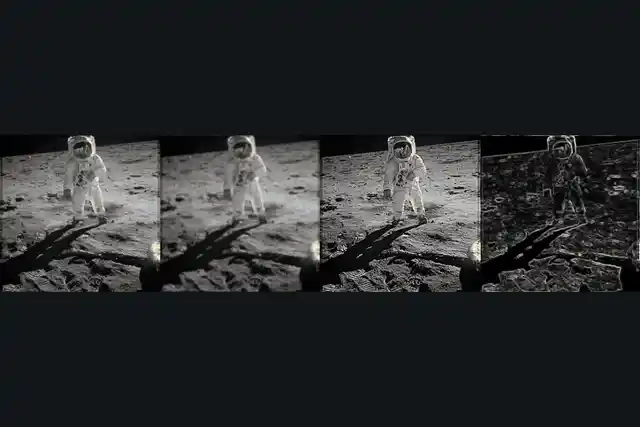

# image

<p align="center">
  
</p>

Pictures as X_eTaL arrays: a PNG or JPEG read into a Float array of
values from 0 to 1 -- height by width for gray, height by width by 3
for color -- and an array written back as a picture, through the
`image` crate. Once a photo is an array, X_eTaL does the rest:
filters, edges, statistics, compression.

- Package: `extensions/image/` (`extension.toml`; library
  `xetal_ext_image`: `libxetal_ext_image.dylib` on macOS, `.so` on
  Linux)
- Facade: `lib/Image.xtl`, recommended alias `im:`
- Native crates: `image` 0.25 (PNG and JPEG only); `tempfile` for tests

## From X_eTaL

```
"im:" u_se< "Image"
p := im:g_ray "demos/data/photo.jpg"        # h by w, 0 (black) to 1 (white)
im:s_ize "demos/data/photo.jpg"              # height width
e := 0.0 m_ax p - 1 o_-_2 p                  # a vertical-edge filter, in X_eTaL
"work/edges.png" im:w_rite! 4.0 * e          # back to a PNG
```

| Export | Type | What |
| ------ | ---- | ---- |
| `im:r_ead path` | `Char -> Float` | the picture as it is: h by w (gray) or h by w by 3 (color); alpha dropped |
| `im:g_ray path` | `Char -> Float` | the picture in gray (its luminance), h by w |
| `im:s_ize path` | `Char -> Int` | height and width, without reading the pixels |
| `path im:w_rite! a` | `Num a => Char -> a -> Int` | the array as a PNG (or a JPEG, by the name's extension), values clamped to 0..1 (NaN is 0); how many pixels |
| `(h c_at w) im:r_esize a` | `(Num a, Num b) => a -> b -> Float` | the picture resampled to h by w (Lanczos); gray stays gray |

Native functions: `read`, `gray`, `size`, `write`, `resize` (`just
list`).

Each 8-bit level k reads as k / 255, so a picture written and read
back is the same array. Files are named by paths under the working
directory (or `XETAL_IMAGE_ROOT`): relative, with no `..`. Pictures are
limited to 64 megapixels. Arrays cross the `ext:` bridge as text
(about 0.35 microseconds a number), so a 400 by 300 color photo takes
a few tenths of a second each way: read once, compute, write once.

## Build and test

```sh
just build      # the native library and xetal-x
just test       # Rust tests (rust/tests) and reg-rs tests (tests/)
just list       # the functions as xetal-x sees them
```

The tests make their pictures (nothing is downloaded): gray and color
written and read back exactly, values clamped, JPEG by the name,
resizing, the errors. The reg-rs tests pin the facade's types, a round
trip from X_eTaL, and the error for a path outside.

## Demos

- `demos/photo-lab.xtl` (`just demo image photo-lab`; pictures in
  `work/photo-lab/`): a photo is an array. Buzz Aldrin on the Moon
  (Apollo 11, NASA, public domain; `demos/data/PROVENANCE.txt`), read
  in gray and resized to 240 by 246, then, all in X_eTaL:
  - a box blur, a sharpen and Sobel edges, each by rotating the array
    and summing (the idiom of Life: every pixel and its eight
    neighbors at once; the borders wrap, so the edge picture has a
    frame);
  - a sepia toning: every pixel's red, green and blue times one 3 by
    3 matrix, an inner product over the last axis;
  - the SVD (the linalg extension): the photo as a sum of rank-1
    pictures, rebuilt from the largest 5, 20 and 50 -- 94%, 98% and
    99% of the energy, storing 4%, 17% and 41% of the numbers, off by
    0.107, 0.066 and 0.039 (root mean square, on 0 to 1).

  It runs in under 3 seconds (release build); `image-demo-photo-lab`
  pins its numbers.

## Recording

`videos/photo-lab.webm` (and `.webp`) show the photo lab's three
pictures in turn (`just videos image`): the demo runs, then its PNGs
become the frames (`videos/photo-lab.pics`).
