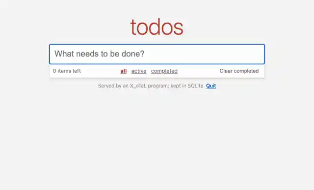
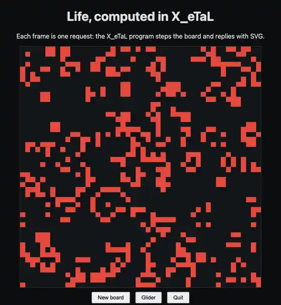

# web

<p align="center">
  
  
</p>

HTTP serving for X_eTaL, where the program is the request loop: axum
serves on 127.0.0.1 in the background and queues each request; the
program takes the next one, reads its method, path, query, form fields
and body, and replies with a status and a body. Rust never calls into
X_eTaL; the program drives.

- Package: `extensions/web/` (`extension.toml`; library
  `xetal_ext_web`: `libxetal_ext_web.dylib` on macOS, `.so` on Linux)
- Facade: `lib/Web.xtl`, recommended alias `wb:`
- Native crates: `axum` 0.8 (HTTP/1), `tokio` (its own runtime, on a
  background thread), `form_urlencoded`

## From X_eTaL

```
"wb:" u_se< "Web"
port := wb:s_erve! 8470                       # http://127.0.0.1:8470/

u:a_nswer := { n ->
  r := wb:n_ext! 60                           # "GET /hello", or "none"
  r m_atch "GET /hello" ? 200 wb:r_eply! "hello, " c_at wb:p_aram "name"
  404 wb:r_eply! "no such page: " c_at wb:p_ath @
}
answered := 100 'u:a_nswer p_ower 0          # a hundred requests
wb:s_top! @
```

| Export | Type | What |
| ------ | ---- | ---- |
| `wb:s_erve! port` | `Num a => a -> Int` | serve on 127.0.0.1 at the port (8470 is this repository's; 0 takes any free one); the port. Serving again on the same port returns it |
| `wb:n_ext! seconds` | `Num a => a -> Char` | wait up to that long for a request: `"GET /path"` (method and path), or `"none"` |
| `wb:m_ethod @`, `wb:p_ath @`, `wb:q_uery @`, `wb:b_ody @` | `Unit -> Char` | the request being answered: its method, path, query as sent, body |
| `wb:p_aram name` | `Char -> Char` | a query field, or a form field of a form POST, decoded; `""` when absent |
| `wb:c_ontent! type` | `Char -> Int` | the reply's content type; without it, the body decides: SVG, HTML, JSON, or plain text |
| `wb:h_eader! "Name: value"` | `Char -> Int` | a header on the reply: a redirect's `Location`, `Cache-Control`, ... (content type and length are not set this way); how many the reply has |
| `status wb:r_eply! body` | `Num a => a -> Char -> Int` | answer the request; the body's length in bytes |
| `wb:f_iles! dir` | `Char -> Int` | serve the files under `dir` (relative, no `..`) directly, without the program; `""` stops; how many files |
| `wb:s_top! @` | `Unit -> Int` | stop serving; the port, or 0 |

Native functions: `serve`, `next`, `method`, `path`, `query`, `body`,
`param`, `content`, `header`, `reply`, `files`, `stop` (`just list`).

## How it behaves

- **Loopback only.** The server listens on 127.0.0.1, never on other
  interfaces; one server per program.
- **A bounded queue.** Up to 64 requests wait for the program; one
  more is answered `503 busy` at once.
- **Timeouts.** A request waits up to 10 seconds for its reply
  (`XETAL_WEB_TIMEOUT`, in seconds), then is answered `504`. A request
  the program took and did not answer before taking the next is
  answered `500`; so are those waiting when the server stops.
- **The port.** `XETAL_WEB_PORT`, when set, replaces the port the
  program asks for (`0` takes any free one): the tests run the demos
  that way and read the port they print.
- **Text bodies.** Bodies are text (UTF-8; other bytes are replaced).
  Files served by `wb:f_iles!` are sent as they are, typed by their
  extension.

Errors are X_eTaL errors with the extension's message:

```
error[io]: []N_GET: ext:web/next: not serving: call wb:s_erve! first at ./lib/Web.xtl:16:1
```

## Build and test

```sh
just build      # the native library and xetal-x
just test       # Rust tests (rust/tests) and reg-rs tests (tests/)
just list       # the functions as xetal-x sees them
```

The Rust tests serve on loopback and ask with a real HTTP client: the
whole flow through the loader, the queue filling up (503), a reply
that comes too late (504), files, query and form fields. The reg-rs
tests pin the facade's types and errors, and `web-serve` runs an
X_eTaL program answering four requests that `curl` asks
(`tests/serve.sh`): a query, a form, an SVG, a 404.

## Demos

- `demos/life.xtl` (`just demo web life`, then open
  http://127.0.0.1:8470/): Conway's Life kept by the X_eTaL program
  and drawn as SVG, one generation per request. The page reloads the
  board several times a second; each reload is a request the program
  answers by stepping the board (`u:l_ife`, one array expression) and
  writing it as an SVG path, one unit square per live cell. New board
  (`/new?n=64`), Glider (`/glider`) and Quit (`/quit`, which ends the
  program) are requests too. The test `web-demo-life` drives it with
  `curl`: a glider on an 8 by 8 board, stepped three times.
- `demos/todomvc.xtl` (`just demo web todomvc`, then open
  http://127.0.0.1:8470/): TodoMVC with plain HTML forms, the todos
  kept in SQLite (`work/todos.db`, with the sqlite extension). The
  X_eTaL program routes each request, turns the chosen filter (all,
  active, completed) into SQL, counts the items left from the `done`
  column, and writes the page; SQL writes each item (escaping the
  title). Adding, toggling, deleting and clearing post a form and are
  redirected back (`303`, `wb:h_eader! "Location: /"`). The test
  `web-demo-todomvc` drives it with `curl`, runs it again to show the
  list was kept, and checks that a title like `<eggs>` is escaped.

## Recording

`videos/life.webm` and `videos/todomvc.webm` (and `.webp`) show the
two pages as a browser draws them (`just videos web`): each demo is
served on a free port, driven by the steps in `videos/NAME.web`, and
every shot is the page rendered by headless Chrome (its own temporary
profile; no window opens).
